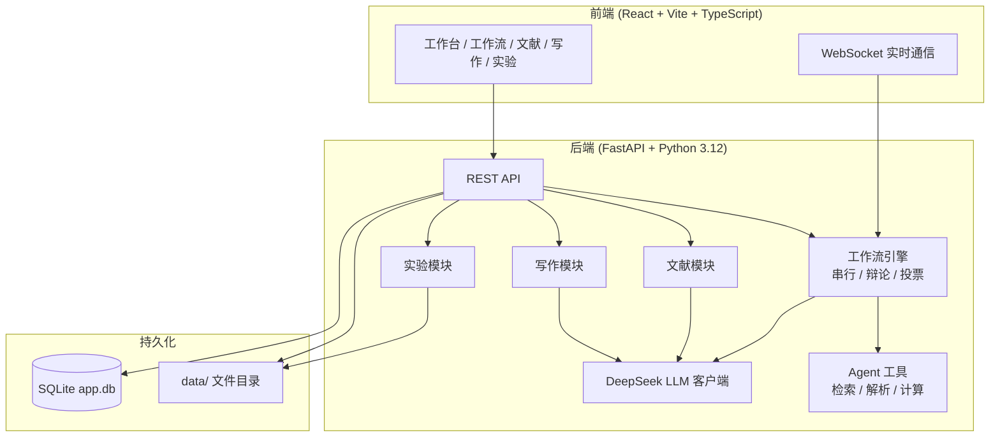

# CrewMind · 智能科研协作平台

CrewMind 是一个面向科研任务的AI Agents协作平台，将 **工作方案制定**、**文献阅读分析**、**学术论文写作** 与 **实验数据管理** 整合在同一套工作流中。您只需用自然语言描述研究需求，系统便会调度课题规划师、文献调研专家、实验方案设计师、预算分析师、方案终审专家等专业角色，自动完成方案制定全流程；也可上传 PDF 构建个人文献库，基于 IMRaD 结构逐章撰写期刊/会议/学位论文，并用电子实验记录本管理实验过程与数据分析。

平台在预算审批、方案终审等关键节点主动暂停，等待研究者审核把关，实现 AI 辅助与人工决策的协同闭环。

---

## 目录

- [核心特点](#核心特点)
- [功能模块](#功能模块)
- [技术架构](#技术架构)
- [快速开始](#快速开始)
- [环境变量](#环境变量)
- [使用指南](#使用指南)
  - [方案与多智能体协作](#工作方案与多智能体协作)
  - [智能文献阅读助手](#智能文献阅读助手)
  - [学术写作辅助](#学术写作辅助)
  - [实验数据管理](#实验数据管理)
- [工作场景与任务流程](#工作场景与任务流程)
- [内置 Agent 与工具](#内置-agent-与工具)
- [数据存储](#数据存储)
- [API 概览](#api-概览)
- [项目结构](#项目结构)
- [开发与测试](#开发与测试)
- [容器化部署](#容器化部署)
- [常见问题](#常见问题)
- [License](#license)

---

## 核心特点

### 多智能体工作方案

- **多角色协作** — 课题规划师、文献专家、实验设计师、预算分析师、终审专家分工配合，可按场景自由勾选参与角色
- **三种协作模式** — 串行（按流程依次执行）、辩论（正反方多轮答辩后裁判整合）、投票（多求解者并行生成后聚合最优）
- **四种工作场景** — 文献综述、实验方案设计、完整工作方案、基于文献的开题报告
- **工作流模板** — 推荐模板与自定义模板，支持 `{{变量名}}` 占位符快速复用配置
- **人机协同** — 预算编制、方案终审等步骤自动暂停，可审核输出、提出修改意见后再继续或终止
- **实时可见** — WebSocket 流式展示各 Agent 输出与工具调用进度，运行中可中止、从中断处继续
- **参考文件** — 上传 txt / md / csv / json 作为背景资料（单文件最大 2MB）
- **历史与版本** — 方案按课题自动归组、版本编号；支持并排对比差异、标注优劣、标记「当前最佳版本」
- **一键导出** — Markdown、Word（`.docx`）、LaTeX（`.tex`）；开题报告场景支持「仅开题报告」精简导出
- **自定义 Agent** — 可创建专属角色（背景、目标、工具绑定、推理模式）
- **学科审稿** — 内置计算机、生物学、材料化学等领域审稿专家，可按需加入工作流

### 文献 · 写作 · 实验

- **智能文献阅读助手** — PDF 上传、AI 分析（含 LaTeX 公式提取与 KaTeX 渲染）、筛选选定、研究空白识别、一键生成开题报告
- **学术写作辅助** — IMRaD 结构、AI 大纲、分段扩写/润色、术语/连贯性/风格检查、引文推荐与校验、章节版本管理、Markdown/Word 导出
- **方案转论文** — 历史工作方案可一键创建写作项目，自动填充大纲与各章节初稿
- **实验数据管理** — 电子实验记录本（ELN）、CSV/Excel 自动统计图表与显著性检验、与历史方案联动对比预期 vs 实际数据

### 平台能力

- **多用户隔离** — 注册登录后，历史方案、文献库、写作项目、实验记录按用户独立存储
- **应用内帮助** — 侧边栏「使用帮助」提供完整操作指南

---

## 功能模块


| 模块           | 入口            | 主要能力                       |
| ------------ | ------------- | -------------------------- |
| **工作台**      | 侧边栏「工作台」      | 选择场景/协作模式/Agent，描述需求，启动工作流 |
| **工作流**      | 启动后自动跳转       | 实时流式输出、人工审核、中止/继续、导出       |
| **Agent 角色** | 侧边栏「Agent 角色」 | 查看内置角色、创建/编辑自定义 Agent      |
| **历史方案**     | 侧边栏「历史方案」     | 课题分组、版本对比、导出、转写作项目/实验      |
| **文献助手**     | 侧边栏「文献助手」     | 工作空间、PDF 分析、选定文献、开题报告      |
| **学术写作**     | 侧边栏「学术写作」     | 写作项目、大纲、扩写润色、引文、导出         |
| **实验管理**     | 侧边栏「实验管理」     | ELN、数据分析、方案对比              |
| **使用帮助**     | 侧边栏「使用帮助」     | 分章节操作说明                    |


---

## 技术架构




**技术栈**


| 层级   | 技术                                                         |
| ---- | ---------------------------------------------------------- |
| 前端   | React 18、TypeScript、Vite、react-markdown、KaTeX、Lucide Icons |
| 后端   | FastAPI、Uvicorn、SQLAlchemy、aiosqlite、Pydantic              |
| AI   | DeepSeek API（`deepseek-chat` / `deepseek-reasoner`）        |
| 文献检索 | Semantic Scholar、PubMed                                    |
| 文档处理 | python-docx、pypdf、markdown                                 |
| 数据分析 | pandas、scipy、matplotlib、openpyxl                           |
| 认证   | JWT + bcrypt                                               |
| 部署   | Docker 多阶段构建（Node 构建前端 + Python 运行时）                       |


---

## 快速开始

### 环境要求

- **Python** 3.12+
- **Node.js** 20+（仅本地开发前端时需要）
- **DeepSeek API Key**（[获取地址](https://platform.deepseek.com/)），目前仅使用DeepSeek

### 1. 克隆与配置

```bash
git clone https://github.com/Gangan-njust/AgentCrew.git
cd AgentCrew

cp .env.example .env
```

编辑 `.env`，**至少填写**：


| 变量                 | 说明                       |
| ------------------ | ------------------------ |
| `DEEPSEEK_API_KEY` | DeepSeek API 密钥          |
| `JWT_SECRET`       | 登录令牌密钥，**生产环境务必改为随机字符串** |


可选：`SEMANTIC_SCHOLAR_API_KEY` 可提高文献检索与 DOI 元数据补全速率；`ADMIN_PASSWORD` 可修改默认管理员密码。完整变量见 [环境变量](#环境变量)。

### 2. 安装依赖

```bash
# 后端
pip install -r requirements.txt

# 前端
cd frontend && npm install && cd ..
```

### 3. 启动服务

```bash
# 终端 1：后端（http://localhost:8000）
python run.py

# 终端 2：前端开发服务器（http://localhost:3000）
cd frontend && npm run dev
```

浏览器访问 **[http://localhost:3000](http://localhost:3000)** 即可使用（开发模式下前端通过 Vite 代理访问后端 API）。

### 4. 登录

首次启动会自动创建管理员账号：


| 用户名     | 密码                                        |
| ------- | ----------------------------------------- |
| `admin` | `.env` 中的 `ADMIN_PASSWORD`（默认 `admin123`） |


也可在登录页注册新账号。每个用户的数据相互独立。

### 5. 生产模式（单进程）

构建前端后，只需启动后端即可同时提供 Web 界面：

```bash
cd frontend && npm run build && cd ..
python run.py
```

访问 **[http://localhost:8000](http://localhost:8000)**。部署前请修改 `JWT_SECRET` 与 `ADMIN_PASSWORD`。

---

## 环境变量


| 变量                         | 默认值                        | 说明                           |
| -------------------------- | -------------------------- | ---------------------------- |
| `DEEPSEEK_API_KEY`         | —                          | DeepSeek API 密钥（必填）          |
| `DEEPSEEK_BASE_URL`        | `https://api.deepseek.com` | API 基础地址                     |
| `DEEPSEEK_MODEL`           | `deepseek-chat`            | 常规模型                         |
| `DEEPSEEK_REASONING_MODEL` | `deepseek-reasoner`        | 推理增强模型（实验设计、终审等角色）           |
| `APP_HOST`                 | `0.0.0.0`                  | 监听地址                         |
| `APP_PORT`                 | `8000`                     | 监听端口                         |
| `LOG_LEVEL`                | `INFO`                     | 日志级别                         |
| `MAX_ITERATIONS`           | `3`                        | 辩论模式最大轮次                     |
| `DEFAULT_TEMPERATURE`      | `0.7`                      | LLM 默认温度                     |
| `DATA_DIR`                 | `./data`                   | 数据根目录                        |
| `RESULTS_DIR`              | `./data/results`           | 历史方案 JSON                    |
| `UPLOADS_DIR`              | `./data/uploads`           | 工作流参考文件                      |
| `DATABASE_URL`             | （空，自动使用 `DATA_DIR/app.db`） | SQLite 连接串                   |
| `SEMANTIC_SCHOLAR_API_KEY` | —                          | Semantic Scholar API Key（可选） |
| `JWT_SECRET`               | `change-me-in-production`  | JWT 签名密钥                     |
| `ADMIN_PASSWORD`           | `admin123`                 | 首次启动创建的管理员密码                 |


**代码内配置**（`backend/config.py`，暂不支持 `.env` 覆盖）：


| 配置项                               | 默认值                  | 说明          |
| --------------------------------- | -------------------- | ----------- |
| `literature_dir`                  | `./data/literature`  | 文献 PDF 存储目录 |
| `experiment_dir`                  | `./data/experiments` | 实验附件与数据集目录  |
| `literature_analysis_concurrency` | `3`                  | 文献批量分析并发数   |


---

## 使用指南

> 应用内可通过侧边栏 **使用帮助** 查看带截图的操作说明。

### 工作方案与多智能体协作

#### 创建工作方案

1. 登录后进入 **工作台**
2. （可选）从 **推荐模板** 或 **我的模板** 快速开始，填写 `{{变量名}}` 占位参数
3. 选择 **协作模式**（串行 / 辩论 / 投票）
4. 选择 **场景类型**（文献综述 / 实验方案 / 完整方案 / 基于文献的开题报告）
5. 勾选本次参与协作的 Agent（串行模式下可自由勾选；取消某角色将跳过其对应任务）
6. 在文本框中详细描述研究课题：背景、目标、约束条件等（至少 10 字）
7. （可选）上传参考文件（txt / md / csv / json，单文件最大 2MB）
8. 点击 **启动多智能体工作流**，进入工作流页面实时查看进度

#### 协作模式


| 模式       | 标识           | 说明                                       |
| -------- | ------------ | ---------------------------------------- |
| **串行模式** | `sequential` | 按场景定义的固定流程依次执行，可自由勾选参与角色                 |
| **辩论模式** | `debate`     | 正反方多轮答辩（最多 `MAX_ITERATIONS` 轮），由裁判整合完善方案 |
| **投票模式** | `voting`     | 多个求解者并行生成方案，聚合后选出最优结果                    |


#### 工作流进行中

- 各 Agent 的输出会 **逐段流式显示**，工具调用（文献检索、文件解析、样本量计算等）状态同步展示
- 遇到需人工审核的节点（预算编制、方案终审），页面出现 **审核面板**：可填写修改意见，选择批准继续或驳回终止
- 运行中可随时 **中止**；之后可从断点 **继续** 执行
- 完成后可 **导出 Markdown、Word 或 LaTeX**；开题报告场景还可选择 **仅开题报告** 精简导出

#### 工作流模板

- 在工作台可将当前配置 **保存为模板**（场景、Agent、需求描述结构）
- 模板支持 `{{变量名}}` 占位符，使用时填写参数自动生成完整需求
- 历史方案页面也可 **保存为模板**，便于复用已有课题配置

#### 管理 Agent 角色

进入 **Agent 角色** 页面：

- 查看内置核心协作角色与学科领域审稿专家
- 新建自定义角色：名称、职称、背景、目标、可用工具、是否启用推理模式
- 编辑或删除自己创建的自定义角色

自定义角色创建后，可在工作台中与其他内置角色一起勾选使用。

#### 查看历史方案

进入 **历史方案** 页面：

- 列表按 **课题** 分组展示，每个课题可包含多个方案版本
- 顶部 **搜索框** 支持按标题或需求描述检索
- 点击课题进入版本列表，可查看各版本详情、导出 Markdown / Word / LaTeX
- 勾选两个版本后点击 **对比所选版本**，并排查看各任务差异与优劣分析
- 点击 **设为最佳** 标记当前课题的最佳方案版本
- 点击 **再生成一版** 可基于同一课题快速启动新的工作流
- 在方案详情页可 **创建写作项目** 或 **创建实验记录**（关联方案预期指标）

相同场景与需求描述的方案会自动归入同一课题；版本号按生成顺序递增。

---

### 智能文献阅读助手

侧边栏进入 **文献助手**，管理个人文献库并驱动开题报告生成。

#### 1. 创建工作空间

按课题或项目建立文献库（如「深度学习综述」），每个工作空间独立管理 PDF 与选定文献。

#### 2. 上传 PDF

拖拽或批量选择 PDF 文件。系统自动：

- 提取全文文本
- 尝试从 PDF 或 CrossRef / Semantic Scholar 补全 DOI、标题、作者、年份等元数据

#### 3. 智能分析

批量触发 AI 分析（默认并发 3 篇），通过 WebSocket 实时推送进度。每篇文献提取：


| 分析项      | 说明                   |
| -------- | -------------------- |
| 研究背景与方法  | 结构化摘要                |
| 核心贡献与创新点 | 便于综述撰写               |
| 局限性      | 识别不足                 |
| 关键公式     | LaTeX 格式，前端 KaTeX 渲染 |
| 标签       | 便于筛选分类               |
| 待引语句式    | 可直接复制到论文正文           |
| 匹配度评分    | 相对研究主题的相关性           |


#### 4. 筛选与选定

- 按关键词、标签、年份、匹配度筛选与排序
- 将重要文献加入 **已选定** 面板
- 可 **保存为模板** 以便复用选定组合

#### 5. 研究空白识别

基于已分析文献汇总研究空白与创新方向建议。

#### 6. 生成开题报告

从选定文献面板点击 **生成开题报告**：

1. 勾选参与 Agent
2. 选择数据源权重：**仅文献库** / **文献为主** / **网络为主**
3. 填写研究主题与补充要求
4. 跳转工作流页面，Agent 优先引用用户文献库内容并在正文标注 `[编号]`

#### 7. 文献详情与导出

- 查看/编辑分析结果（含公式 LaTeX 与变量说明）
- 一键复制待引语句式
- 导出选定文献为 **BibTeX**、**EndNote**、**APA** 或 **GB/T 7714** 格式

---

### 学术写作辅助

侧边栏进入 **学术写作**，管理写作项目并借助 AI 完成论文撰写。

#### 1. 创建写作项目


| 论文类型     | 章节结构                       |
| -------- | -------------------------- |
| **期刊论文** | 摘要、Abstract、引言、方法、结果、讨论、结论 |
| **会议论文** | 同上（篇幅目标更短）                 |
| **学位论文** | 另含相关工作、致谢等                 |


填写标题、研究主题与目标期刊；可关联文献工作空间以便引文推荐。

也可从 **历史方案详情** 一键创建项目：系统自动生成 IMRaD 大纲，并将各 Agent 输出映射到对应章节初稿。

#### 2. AI 生成大纲

根据研究主题自动生成章节结构与写作要点；支持基于工作方案内容定制。

#### 3. 分段撰写

- 按章节编辑正文，支持二级至四级 Markdown 子标题
- 编辑器自动保存
- 可切换 **单章预览** 或 **全文预览**（含公式渲染）

#### 4. AI 写作工具（右侧工具面板）


| 工具     | 能力                            |
| ------ | ----------------------------- |
| **扩写** | 自由扩写或按子标题结构化扩写；短 / 中 / 长篇幅    |
| **润色** | 保守 / 中等 / 深度三档；支持结构化逐段润色      |
| **检查** | 术语一致性、全文连贯性、学术风格、空行格式         |
| **引文** | 基于关联文献库推荐引用、生成待引语句式、校验正文引文完整性 |
| **版本** | 章节历史版本、并排对比差异、回滚至指定版本         |


#### 5. 一键补全

「按大纲补全」可批量生成所有空白或草稿章节。

#### 6. 导出

支持导出 **Markdown** 或 **Word**（`.docx`），自动附带参考文献列表。引用格式可选：

- GB/T 7714
- APA
- MLA
- Chicago

---

### 实验数据管理

侧边栏进入 **实验管理**，记录实验过程、分析数据并与工作方案联动。

#### 1. 创建实验

- **手动创建**：填写标题与描述
- **从工作方案创建**：系统自动从实验方案任务输出中提取预期指标（样本量、准确率、温度、浓度等），建立预期 vs 实际对比基准

#### 2. 实验记录本（ELN）

按实验步骤记录：


| 记录类型     | 用途      |
| -------- | ------- |
| **观察记录** | 现象、操作过程 |
| **测量数据** | 数值读数    |
| **备注**   | 其他说明    |


每条记录支持：

- 标题、步骤名称、实验笔记
- **仪器参数**（JSON 键值对）
- **原始数据**（JSON 键值对）
- **照片附件**（jpg/png/gif/webp 等，单张最大 5MB）

#### 3. 数据分析

上传 **CSV / Excel**（`.csv`、`.xlsx`、`.xls`，单文件最大 10MB，最多 50,000 行），系统自动：

- 识别数值列与分组列
- 生成 **直方图**、**箱线图**、**组间均值柱状图**
- 执行描述统计
- 两组比较：**Welch t 检验**
- 多组比较：**单因素方差分析（ANOVA）**

可手动指定数值列与分组列后重新分析。

#### 4. 方案对比

若实验关联了工作方案，**方案对比** 页将预期指标与实际数据集对比，状态包括：


| 状态  | 含义      |
| --- | ------- |
| 达标  | 实际值符合预期 |
| 需关注 | 与预期存在偏差 |
| 不足  | 未达预期    |
| 无数据 | 尚未上传数据集 |


---

## 工作场景与任务流程


| 场景            | 标识                          | 适用情况               | 默认协作流程                                  |
| ------------- | --------------------------- | ------------------ | --------------------------------------- |
| **文献综述生成**    | `literature_review`         | 梳理领域文献、形成综述框架      | 课题规划 → 文献调研 → （可选学科审稿）→ 方案终审            |
| **实验方案设计**    | `experiment_design`         | 已有方向，需设计实验方法与预算    | 课题规划 → 实验设计 → 预算编制 ★ → （可选学科审稿）→ 方案终审 ★ |
| **完整工作方案**    | `full_proposal`             | 从零到完整方案的一站式制定      | 五个核心 Agent 全流程 + 可选学科审稿                 |
| **基于文献的开题报告** | `literature_based_proposal` | 已有 PDF 文献库，需生成开题报告 | 课题规划 → 文献整合 → 方法设计 → 预算 ★ → 开题终审 ★      |


> ★ 表示该步骤需要 **人工审核**（`requires_human_review`）。

**基于文献的开题报告** 通常从文献助手发起：系统将选定文献的分析结果注入工作流上下文，Agent 优先引用用户文献库并在正文标注 `[编号]`。

勾选学科审稿专家（计算机 / 生物 / 材料）时，会在核心任务完成后并行生成对应学科的评审意见，终审专家综合所有意见输出最终方案。

---

## 内置 Agent 与工具

### 核心协作角色


| 角色 ID                   | 名称      | 职责                      | 工具        | 推理模式 |
| ----------------------- | ------- | ----------------------- | --------- | ---- |
| `planner`               | 课题规划师   | 分析需求，梳理研究框架与关键问题        | 文件解析      | —    |
| `literature_researcher` | 文献调研专家  | 检索文献、整理综述；有文献库时优先整合用户文献 | 文献检索、文件解析 | —    |
| `experiment_designer`   | 实验方案设计师 | 设计实验方法、对照组、样本量等         | 代码解释器     | ✓    |
| `resource_analyst`      | 预算资源分析师 | 估算人力、设备、试剂等资源与预算        | —         | —    |
| `review_specialist`     | 方案终审专家  | 整合各阶段成果，质量评审与最终定稿       | —         | ✓    |


### 学科领域审稿专家（可选）


| 角色 ID                       | 名称         | 审查重点                   |
| --------------------------- | ---------- | ---------------------- |
| `cs_journal_reviewer`       | 计算机学报专家    | 算法创新性、实验完备性、可复现性、基线公平性 |
| `bio_journal_reviewer`      | 生物学/生命科学专家 | 对照组、样本量、统计方法、伦理合规      |
| `material_journal_reviewer` | 材料/化学专家    | 制备路线、表征完备性、性能测试、批次一致性  |


### Agent 工具


| 工具 ID              | 名称    | 功能                                  |
| ------------------ | ----- | ----------------------------------- |
| `web_search`       | 文献检索  | 调用 Semantic Scholar / PubMed 检索学术文献 |
| `file_parser`      | 文件解析  | 解析用户上传的参考文件内容                       |
| `code_interpreter` | 代码解释器 | 样本量估算、统计与预算相关数值计算                   |


自定义 Agent 可从以上工具中勾选绑定。

---

## 数据存储

默认数据目录为 `data/`（可通过 `DATA_DIR` 配置）：

```
data/
├── app.db              # SQLite：用户、方案、文献库、写作项目、实验记录
├── results/            # 历史方案 JSON 备份
├── uploads/            # 工作流参考文件（txt/md/csv/json）
├── literature/         # 文献助手 PDF（按工作空间分目录）
└── experiments/        # 实验附件、数据集、分析图表缓存
```

**请定期备份 `data/` 目录**，删除该目录将导致数据丢失。

进行中的工作流状态保存在 **内存** 中，服务重启后会丢失；已完成的方案、文献分析、写作内容与实验数据均持久化在数据库与文件系统中。

---

## API 概览

后端启动后访问 **[http://localhost:8000/docs](http://localhost:8000/docs)** 查看 Swagger 交互文档（多数接口需 Bearer Token）。

### 认证


| 方法   | 路径                   | 说明        |
| ---- | -------------------- | --------- |
| POST | `/api/auth/register` | 注册        |
| POST | `/api/auth/login`    | 登录，返回 JWT |
| GET  | `/api/auth/me`       | 当前用户信息    |


### 工作方案


| 方法   | 路径                                 | 说明       |
| ---- | ---------------------------------- | -------- |
| GET  | `/api/scenarios`                   | 场景列表     |
| GET  | `/api/agents`                      | Agent 列表 |
| GET  | `/api/collaboration-modes`         | 协作模式列表   |
| POST | `/api/workflow/start`              | 启动工作流    |
| GET  | `/api/workflow/{crew_id}`          | 工作流状态    |
| POST | `/api/workflow/{crew_id}/feedback` | 人工审核反馈   |
| POST | `/api/workflow/{crew_id}/suspend`  | 中止       |
| POST | `/api/workflow/{crew_id}/resume`   | 继续       |
| GET  | `/api/workflow/{crew_id}/export`   | 导出进行中的方案 |
| WS   | `/ws/{crew_id}`                    | 实时进度推送   |


### 历史与模板


| 方法              | 路径                                | 说明         |
| --------------- | --------------------------------- | ---------- |
| GET             | `/api/results`                    | 历史方案列表     |
| GET             | `/api/topics`                     | 课题列表       |
| GET             | `/api/topics/{topic_id}/versions` | 课题版本列表     |
| POST            | `/api/topics/{topic_id}/best`     | 标记最佳版本     |
| POST            | `/api/results/compare`            | 版本对比       |
| GET             | `/api/results/{record_id}/export` | 导出已完成方案    |
| GET/POST/DELETE | `/api/templates`                  | 工作流模板 CRUD |


### 子模块 API


| 前缀                    | 模块                     |
| --------------------- | ---------------------- |
| `/api/literature/...` | 文献助手（工作空间、上传、分析、选定、导出） |
| `/api/writing/...`    | 学术写作（项目、章节、扩写润色、引文、导出） |
| `/api/experiment/...` | 实验管理（ELN、数据集、分析、方案对比）  |


### 健康检查


| 方法  | 路径            | 说明                            |
| --- | ------------- | ----------------------------- |
| GET | `/api/health` | 服务健康状态（Docker HEALTHCHECK 使用） |


---

## 项目结构

```
CrewMind/
├── backend/
│   ├── agents/              # Agent 角色定义与注册
│   │   ├── roles.py         # 内置角色与场景配置
│   │   └── registry.py      # 自定义 Agent CRUD
│   ├── crew/                # 工作流引擎
│   │   ├── engine.py        # 串行执行核心
│   │   ├── debate.py        # 辩论模式
│   │   ├── voting.py        # 投票模式
│   │   └── manager.py       # 工作流生命周期管理
│   ├── literature/          # 文献模块
│   │   ├── parser.py        # PDF 解析
│   │   ├── analyzer.py      # AI 分析
│   │   ├── filter.py        # 筛选
│   │   ├── selection.py     # 选定文献
│   │   ├── export.py        # BibTeX / APA 等导出
│   │   └── integration.py   # 开题报告工作流集成
│   ├── writing/             # 学术写作模块
│   │   ├── outline.py       # 大纲生成
│   │   ├── completion.py    # 扩写 / 润色 / 补全
│   │   ├── citations.py     # 引文推荐与校验
│   │   ├── export.py        # Markdown / Word 导出
│   │   └── integration.py   # 工作方案转写作项目
│   ├── experiment/          # 实验数据模块
│   │   ├── analyzer.py      # 统计图表与显著性检验
│   │   ├── comparison.py    # 预期 vs 实际对比
│   │   └── integration.py   # 工作方案转实验记录
│   ├── routes/              # API 路由
│   │   ├── literature.py
│   │   ├── writing.py
│   │   └── experiment.py
│   ├── storage/             # 数据库与持久化
│   ├── tasks/               # 任务定义与协作流程
│   ├── tools/               # Agent 工具实现
│   ├── utils/               # 文本处理、Word 表格等
│   ├── llm/                 # DeepSeek 客户端
│   ├── config.py            # 全局配置
│   ├── auth.py              # JWT 认证
│   └── main.py              # FastAPI 入口
├── frontend/                # React + Vite 前端
│   ├── src/
│   │   ├── App.tsx          # 主应用与路由页面
│   │   ├── api.ts           # API 客户端
│   │   └── components/      # 文献、写作、实验等组件
│   └── public/help/         # 帮助文档截图
├── tests/                   # pytest 测试
├── data/                    # 运行时数据（git 忽略）
├── run.py                   # 后端启动入口
├── requirements.txt
├── Dockerfile               # 多阶段构建
└── docker-compose.yml
```

---

## 开发与测试

### 运行测试

```bash
pytest
```

测试覆盖工作流引擎、文献解析、写作扩写/润色、实验分析、文档导出、任务过滤等模块。

### 扩展开发参考


| 模块       | 路径                             | 说明                   |
| -------- | ------------------------------ | -------------------- |
| Agent 工具 | `backend/tools/`               | 文献检索、文件解析、代码执行等      |
| 任务流程     | `backend/tasks/definitions.py` | 各场景任务定义、提示词模板、人工审核节点 |
| 内置角色     | `backend/agents/roles.py`      | 角色定义与场景-Agent 映射     |
| 文献助手     | `backend/literature/`          | PDF 解析、AI 分析、开题报告集成  |
| 学术写作     | `backend/writing/`             | 大纲、扩写润色、引文、导出        |
| 实验管理     | `backend/experiment/`          | 数据分析、方案对比            |
| 前端页面     | `frontend/src/App.tsx`         | 主界面与各功能页             |
| 帮助文档     | `frontend/src/helpContent.ts`  | 应用内帮助章节内容            |


---

## 容器化部署

推荐使用 Docker 一键部署，镜像内已包含构建好的前端，单容器即可对外提供服务。

### 前置要求

- [Docker](https://docs.docker.com/get-docker/)（Docker Desktop 或 Docker Engine）
- [Docker Compose](https://docs.docker.com/compose/install/)（Docker Desktop 已内置）

### 部署步骤

```bash
git clone https://github.com/Gangan-njust/AgentCrew.git
cd AgentCrew

cp .env.example .env
# 编辑 .env：至少填写 DEEPSEEK_API_KEY，并修改 JWT_SECRET、ADMIN_PASSWORD

docker compose up -d --build
docker compose logs -f   # 可选：查看启动日志
```

浏览器访问 **[http://localhost:8000](http://localhost:8000)**（端口可通过 `.env` 中 `APP_PORT` 修改）。

### 常用运维命令

```bash
docker compose down              # 停止服务
docker compose up -d --build     # 重新构建并启动
docker compose ps                # 查看容器状态
docker compose logs -f crewmind  # 查看实时日志
```

### 仅使用 Docker（不用 Compose）

```bash
docker build -t crewmind/crewmind:latest .
docker run -d \
  --name crewmind \
  -p 8000:8000 \
  --env-file .env \
  -v "$(pwd)/data:/app/data" \
  --restart unless-stopped \
  crewmind/crewmind:latest
```

Windows PowerShell 下挂载卷：`-v ${PWD}/data:/app/data`

### 镜像构建与推送

```bash
docker build -t crewmind/crewmind:latest .

# 推送至阿里云容器镜像服务（替换 registry 地址）
docker login registry.xxx
docker tag crewmind/crewmind:latest registry.xxx/crewmind/crewmind:v1
docker push registry.xxx/crewmind/crewmind:v1
```

### 生产环境建议


| 项目   | 说明                                                                 |
| ---- | ------------------------------------------------------------------ |
| 密钥安全 | 务必修改 `JWT_SECRET`、`ADMIN_PASSWORD`，勿将 `.env` 提交到版本库                |
| 反向代理 | 建议在容器前加 Nginx / Caddy，配置 HTTPS 与 WebSocket 转发（路径 `/ws`）            |
| 端口映射 | 默认 `8000:8000`；修改 `.env` 中 `APP_PORT` 可更改宿主机端口                     |
| 数据备份 | 定期备份挂载的 `data/` 目录                                                 |
| 资源限制 | 多 Agent 工作流会频繁调用 LLM API，可在 `docker-compose.yml` 中按需设置 `mem_limit` |


---

## 常见问题

**Q：服务重启后进行中的工作流还在吗？**  
A：进行中的任务保存在内存中，重启后会丢失；**已完成的方案**会持久保存，可在历史方案中查看。

**Q：文献检索需要什么额外配置？**  
A：默认可用 Semantic Scholar 与 PubMed；配置 `SEMANTIC_SCHOLAR_API_KEY` 可提高检索速率。

**Q：支持哪些参考文件格式？**  
A：工作流参考文件支持 txt、md、csv、json（单文件不超过 2MB）；**文献助手**支持 PDF；**实验管理**支持 CSV/Excel 数据集与图片附件。

**Q：文献分析需要什么配置？**  
A：需要配置 `DEEPSEEK_API_KEY`；可选配置 `SEMANTIC_SCHOLAR_API_KEY` 以加速 DOI 元数据补全。批量分析并发数默认为 3（`literature_analysis_concurrency`）。

**Q：学术写作辅助需要什么配置？**  
A：同样需要 `DEEPSEEK_API_KEY`。写作项目、章节内容与版本历史保存在 `data/app.db`；关联文献工作空间后可使用引文推荐功能。

**Q：写作项目支持哪些导出格式？**  
A：支持 Markdown（`.md`）与 Word（`.docx`）；参考文献格式可选 GB/T 7714、APA、MLA、Chicago。

**Q：实验数据分析支持哪些统计检验？**  
A：自动进行描述统计；两组比较使用 Welch t 检验，三组及以上使用单因素 ANOVA（α=0.05）。

**Q：如何从工作方案创建实验？**  
A：在历史方案详情页或实验管理页选择「从工作方案创建」，系统会从实验设计任务输出中规则提取样本量、准确率等预期指标，上传实际数据后可在「方案对比」页查看达标情况。

**Q：数据存在哪里？**  
A：默认在 `data/` 目录（数据库、上传文件、历史方案、文献 PDF、写作项目、实验数据）。建议定期备份。

**Q：API 文档在哪里？**  
A：后端启动后访问 [http://localhost:8000/docs](http://localhost:8000/docs) 查看 Swagger 交互文档（需登录令牌）。

**Q：开发时前端连不上后端？**  
A：确认后端已在 `8000` 端口运行；Vite 开发服务器默认在 `3000` 端口并通过代理转发 API 请求。

---

