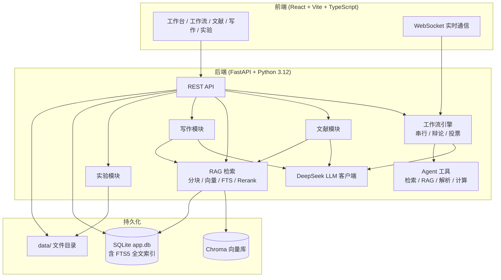

# CrewMind · 一个智能科研协作平台

CrewMind 是一个面向高校课题组与科研团队的多智能体（AI Agents）协作平台，将 **工作方案制定**、**文献阅读分析（含 RAG 检索增强）**、**学术论文写作** 与 **实验数据管理** 整合在同一套工作流中。您只需用自然语言描述研究需求，系统便会调度课题规划师、文献调研专家、实验方案设计师、预算分析师、方案终审专家等专业角色，自动完成方案制定全流程；也可上传 PDF 构建个人文献库并建立向量索引，基于 IMRaD 结构逐章撰写期刊 / 会议 / 学位论文，并用电子实验记录本管理实验过程与数据分析。

平台在预算审批、方案终审等关键节点主动暂停，等待研究者审核把关，实现 AI 辅助与人工决策的协同闭环。

---

## 目录

- [核心特点](#核心特点)
- [功能模块](#功能模块)
- [技术架构](#技术架构)
- [RAG 检索管线](#rag-检索管线)
- [快速开始](#快速开始)
- [环境变量](#环境变量)
- [使用指南](#使用指南)
  - [工作方案与多智能体协作](#工作方案与多智能体协作)
  - [智能文献阅读助手](#智能文献阅读助手)
  - [学术写作辅助](#学术写作辅助)
  - [实验数据管理](#实验数据管理)
- [工作场景与任务流程](#工作场景与任务流程)
- [内置 Agent 与工具](#内置-agent-与工具)
- [数据存储](#数据存储)
- [API 概览](#api-概览)
- [项目结构](#项目结构)
- [开发与测试](#开发与测试)
- [容器化部署](#容器化部署)
- [常见问题](#常见问题)
- [License](#license)

---

## 核心特点

### 多智能体工作方案

- **多角色协作** —— 课题规划师、文献调研专家、实验方案设计师、预算分析师、方案终审专家分工配合，可按场景自由勾选参与角色；另内置计算机 / 生物 / 材料化学等学科审稿专家，可加入工作流并行出具学科评审意见
- **三种协作模式** —— 串行（按流程依次执行，可自由勾选 / 跳过角色）、辩论（正反方多轮答辩后由裁判整合）、投票（多个求解者并行生成方案后聚合选出最优）
- **五种工作场景** —— 文献综述生成、实验方案设计、完整工作方案、基于文献的开题报告、基于文献的文献综述（后两者通常从「文献助手」发起，Agent 优先引用您文献库中的分析结果）
- **工作流模板** —— 推荐模板与自定义模板，支持 `{{变量名}}` 占位符快速复用配置
- **人机协同** —— 预算编制、方案终审 / 开题终审 / 综述终审等步骤自动暂停，可审核输出、填写修改意见后再继续或终止
- **实时可见** —— WebSocket 流式展示各 Agent 输出与工具调用进度，运行中可中止、之后从断点继续
- **运行可靠** —— LLM 瞬时故障自动指数退避重试；失败后可从失败任务处「重试」，已完成子任务结果自动保存，不重复消耗 token
- **参考文件** —— 上传 txt / md / csv / json 作为背景资料（单文件最大 2MB），供 Agent 通过文件解析工具读取
- **历史与版本** —— 方案按课题自动归组、版本编号；支持并排对比差异、标注优劣、标记「当前最佳版本」
- **一键导出** —— Markdown、Word（`.docx`）、LaTeX（`.tex`）；开题报告场景支持「仅开题报告」精简导出；所有场景均可选择「纯综述 / 纯文章」只导出成文正文
- **自定义 Agent** —— 可创建专属角色（名称、专业背景、核心目标、工具绑定、推理模式），并支持从一段角色描述 / 提示词中智能提取配置
- **学科审稿** —— 内置《计算机学报》、生物学 / 生命科学、材料 / 化学等领域审稿专家，可按需加入工作流
### 文献 · 写作 · 实验

- **智能文献阅读助手** —— PDF 上传与批量 AI 分析（含 LaTeX 公式提取与 KaTeX 渲染、文章重要图片自动提取并内联展示）、**RAG 向量索引与文献库问答**、筛选与选定文献、一键生成开题报告 / 文献综述
- **学术写作辅助** —— IMRaD 结构、AI 大纲、分段扩写 / 润色（可注入文献库 RAG 证据）、术语 / 连贯 / 风格 / 引文 / 图表 / Abstract 多维检查、关键词设置与从摘要生成、引文推荐与完整性校验、图表占位与真实素材插入、章节版本管理、Markdown / Word 导出
- **方案转论文** —— 历史工作方案可一键创建写作项目，自动填充大纲与各章节初稿
- **实验数据管理** —— 电子实验记录本（ELN）、实验配置管理（超参数 / 环境 / 代码版本）、CSV / Excel 自动统计图表与显著性检验、训练指标曲线、多实验横向对比、与历史方案联动对比预期 vs 实际数据、一键复现

### 平台能力

- **多用户隔离** —— 注册登录后，历史方案、文献库、写作项目、实验记录按用户独立存储
- **文献 RAG** —— 工作空间级向量索引、混合检索（Chroma + FTS5 + Rerank）与文献库问答，贯通分析 / 写作 / Agent 工具
- **工具箱** —— 查看每次运行的 token 数、耗时、API 调用次数与日志；可配置自己的大模型 API Key / BaseURL / 模型（未配置时自动回退系统 Key，工作流、文献、写作、实验等所有 LLM 调用统一生效）
- **应用内帮助** —— 侧边栏「使用帮助」提供带截图的分章节操作指南

---

## 功能模块

| 模块 | 侧边栏入口 | 主要能力 |
| --- | --- | --- |
| **工作台** | 侧边栏「工作台」 | 选择场景 / 协作模式 / Agent，描述需求，从模板快速开始，启动工作流 |
| **工作流** | 启动后自动跳转 | 实时流式输出、人工审核、中止 / 继续、失败任务重试、导出 |
| **Agent 角色** | 侧边栏「Agent 角色」 | 查看内置角色与学科审稿专家、创建 / 编辑 / 删除自定义 Agent |
| **历史方案** | 侧边栏「历史方案」 | 课题分组、版本对比、标记最佳、保存为模板、导出、转写作项目 / 实验项目 |
| **文献助手** | 侧边栏「文献助手」 | 工作空间、PDF 上传与批量分析、**RAG 索引 / 问答**、筛选选定、生成开题报告 / 文献综述 |
| **学术写作** | 侧边栏「学术写作」 | 写作项目、大纲、扩写润色、多维检查、关键词、引文、图表素材、版本管理、导出 |
| **实验管理** | 侧边栏「实验管理」 | ELN、数据分析、配置与训练指标、多实验对比、方案对比、一键复现 |
| **工具箱** | 侧边栏「工具箱」 | 运行记录统计、调用日志、API 配置（用户 Key 回退系统 Key） |
| **使用帮助** | 侧边栏「使用帮助」 | 带截图的分章节操作说明 |

---

## 技术架构



**技术栈**

| 层级 | 技术 |
| --- | --- |
| 前端 | React 18、TypeScript、Vite、react-markdown、KaTeX、Lucide Icons |
| 后端 | FastAPI、Uvicorn、SQLAlchemy、aiosqlite、Pydantic |
| AI | DeepSeek API（`deepseek-chat` / `deepseek-reasoner`） |
| RAG | Chroma、fastembed（`bge-small-zh`）、SQLite FTS5、bge-reranker |
| 文献检索 | Semantic Scholar、PubMed |
| 文档处理 | python-docx、htmldocx、pypdf、markdown |
| 数据分析 | pandas、scipy、matplotlib、openpyxl |
| 认证 | JWT + bcrypt |
| 部署 | Docker 多阶段构建（Node 构建前端 + Python 运行时） |

---

## RAG 检索管线

文献 PDF 在分析或手动索引时进入索引流水线：`分块 → 向量化 → Chroma + FTS5 双写 → 混合检索 →（可选）Rerank`。实现位于 `backend/rag/`。

### 切块策略

采用 **章节识别 + 段落优先滑窗**（`backend/rag/chunker.py`）：

1. **摘要单独成块** —— 遇到 abstract 时整段作为 `section_key="abstract"` 的独立 chunk，不做滑窗切分；
2. **按章节边界切分** —— 通过 `split_sections()` 按中英关键词识别 IMRaD 章节（introduction / methods / results / discussion / conclusion）；识别不到则整篇归为 `full`；标题前内容归为 `preamble`；
3. **章节内滑窗** —— 默认 `CHUNK_SIZE=600`、`CHUNK_OVERLAP=120`（字符）：
   - 先按空行（`\n\n`）拆成段落，尽量在段落边界合并，不超过 `chunk_size`
   - 超出时落盘当前缓冲，并带上末尾 `overlap` 作为下一块开头
   - 单段本身超过 `chunk_size` 时，才对该段做硬切字符滑窗

每个 chunk 记录 `section_key`、`chunk_index`、`char_start` / `char_end`、`content_hash`，供检索溯源与增量索引判断。

#### 语义辅助切块（可选，默认关闭）

在「段落优先滑窗」基础上，可额外用 **段落 embedding 相似度** 优化合并决策（实验性，`RAG_SEMANTIC_CHUNKING=true` 开启）：

| 信号 | 行为 |
| --- | --- |
| 相邻段落相似度 `< RAG_SEMANTIC_MIN_SIM`（默认 0.50） | **强制切分** —— 语义突降点即使长度有余量也落盘 |
| 相邻段落相似度 `>= RAG_SEMANTIC_MAX_SIM`（默认 0.82） | **允许超限合并** —— 语义相近段落不强行切分，合并后不超过 `chunk_size × RAG_SEMANTIC_MAX_RATIO`（默认 1.30） |

实现仍在 `backend/rag/chunker.py`，复用全局 embedding 模型（`bge-small-zh`）；模型加载或相似度计算失败时**自动回退为纯规则切块**，不影响索引可用性。建议开启后用 `py -3 scripts/benchmark_rag.py` 对比召回率再决定是否投产。

### 检索与重排

| 步骤 | 说明 |
| --- | --- |
| 向量检索 | Chroma + `bge-small-zh` embedding |
| 全文检索 | SQLite FTS5（BM25） |
| 融合 | Reciprocal Rank Fusion（RRF），取 `RAG_TOP_K` 候选 |
| 章节加权 | 可配 `RAG_SECTION_BOOST`：abstract ×1.15、methods ×1.10 |
| 重排 | 可选 bge-reranker，截断为 `RAG_RERANK_TOP_K` 条注入 prompt |

检索结果贯通文献分析上下文、文献库问答、写作扩写 / 引文、Agent `rag_search` 工具。

---

## 快速开始

### 环境要求

- **Python** 3.12+
- **Node.js** 20+（仅本地开发前端时需要）
- **DeepSeek API Key**（[获取地址](https://platform.deepseek.com/)），平台目前使用 DeepSeek

### 1. 克隆与配置

```bash
git clone https://github.com/Gangan-njust/CrewMind.git
cd CrewMind

cp .env.example .env
```

编辑 `.env`，**至少填写**：

| 变量 | 说明 |
| --- | --- |
| `DEEPSEEK_API_KEY` | DeepSeek API 密钥 |
| `JWT_SECRET` | 登录令牌密钥（**生产环境务必改为随机字符串**） |

可选：`SEMANTIC_SCHOLAR_API_KEY` 可提高文献检索与 DOI 元数据补全速率；`ADMIN_PASSWORD` 可修改默认管理员密码。启用 RAG 时建议保留 `HF_ENDPOINT=https://hf-mirror.com`（国内网络）。完整变量见 [环境变量](#环境变量)。

### 2. 安装依赖

```bash
# 后端（Windows 可用 py -3 代替 python）
pip install -r requirements.txt

# 前端
cd frontend && npm install && cd ..
```

### 3. 预加载 RAG 模型（推荐）

首次使用文献索引前，建议预下载向量化与重排序模型（约数百 MB），避免首次索引超时：

```bash
py -3 scripts/preload_rag_models.py
```

国内网络请在 `.env` 中设置 `HF_ENDPOINT=https://hf-mirror.com`。服务启动时也会在后台尝试预加载。

### 4. 启动服务

```bash
# 终端 1：后端（http://localhost:8000）
python run.py   # Windows: py run.py

# 终端 2：前端开发服务器（http://localhost:3000）
cd frontend && npm run dev
```

浏览器访问 **[http://localhost:3000](http://localhost:3000)** 即可使用（开发模式下前端通过 Vite 代理访问后端 API）。

### 5. 登录

首次启动会自动创建管理员账号：

| 用户名 | 密码 |
| --- | --- |
| `admin` | `.env` 中的 `ADMIN_PASSWORD`（默认 `admin123`） |

也可在登录页注册新账号，每个用户的数据相互独立。

### 6. 生产模式（单进程）

构建前端后，只需启动后端即可同时提供 Web 界面：

```bash
cd frontend && npm run build && cd ..
python run.py
```

访问 **[http://localhost:8000](http://localhost:8000)**。部署前请修改 `JWT_SECRET` 与 `ADMIN_PASSWORD`。

---

## 环境变量

完整配置见 `.env.example`，主要变量如下：

| 变量 | 默认值 | 说明 |
| --- | --- | --- |
| `DEEPSEEK_API_KEY` | 空 | DeepSeek API 密钥（必填） |
| `DEEPSEEK_BASE_URL` | `https://api.deepseek.com` | API 基础地址 |
| `DEEPSEEK_MODEL` | `deepseek-chat` | 常规模型 |
| `DEEPSEEK_REASONING_MODEL` | `deepseek-reasoner` | 推理增强模型（实验设计、终审等角色使用） |
| `APP_HOST` | `0.0.0.0` | 监听地址 |
| `APP_PORT` | `8000` | 监听端口 |
| `LOG_LEVEL` | `INFO` | 日志级别 |
| `MAX_ITERATIONS` | `3` | 辩论模式最大轮数 |
| `DEFAULT_TEMPERATURE` | `0.7` | LLM 默认温度 |
| `LLM_MAX_RETRIES` | `2` | LLM 调用失败自动重试次数（网络错误 / 429 / 5xx） |
| `LLM_RETRY_BACKOFF` | `1.5` | LLM 重试退避基数（秒，指数递增：1.5s → 3s → 6s） |
| `DATA_DIR` | `./data` | 数据根目录 |
| `RESULTS_DIR` | `./data/results` | 历史方案 JSON |
| `UPLOADS_DIR` | `./data/uploads` | 工作流参考文件 |
| `DATABASE_URL` | 空（自动使用 `DATA_DIR/app.db`） | SQLite 连接串 |
| `SEMANTIC_SCHOLAR_API_KEY` | 空 | Semantic Scholar API Key（可选，提高检索速率） |
| `JWT_SECRET` | `change-me-in-production` | JWT 签名密钥 |
| `ADMIN_PASSWORD` | `admin123` | 首次启动创建的管理员密码 |
| `RAG_ENABLED` | `true` | 是否启用文献库 RAG |
| `RAG_DIR` | `./data/rag` | Chroma 向量库目录 |
| `HF_ENDPOINT` | `https://hf-mirror.com` | HuggingFace 镜像（国内建议保留） |
| `HF_HUB_DOWNLOAD_TIMEOUT` | `300` | 模型下载超时（秒） |
| `EMBEDDING_MODEL` | `BAAI/bge-small-zh-v1.5` | 向量化模型 |
| `EMBEDDING_PROVIDER` | `fastembed` | `fastembed` 或 `openai`（兼容 API） |
| `EMBEDDING_API_KEY` | 空 | OpenAI 兼容 Embedding API Key（可选） |
| `EMBEDDING_BASE_URL` | 空 | OpenAI 兼容 Embedding API 地址 |
| `CHUNK_SIZE` | `600` | 文献分块大小（字符） |
| `CHUNK_OVERLAP` | `120` | 分块重叠（字符） |
| `RAG_TOP_K` | `8` | 混合检索 RRF 候选数 |
| `RAG_RERANK_TOP_K` | `5` | rerank 后进入 prompt 的最终条数 |
| `RAG_RERANK_ENABLED` | `true` | 是否启用 bge-reranker 重排 |
| `RAG_RERANK_MODEL` | `BAAI/bge-reranker-base` | 重排序模型 |
| `RAG_SECTION_BOOST` | `true` | 混合检索时对 abstract / methods 章节加权 |
| `RAG_INDEX_CONCURRENCY` | `2` | 索引并发数 |
| `RAG_INDEX_MAX_RETRIES` | `2` | 索引失败自动重试次数 |
| `RAG_SEMANTIC_CHUNKING` | `false` | 语义辅助切块（实验性） |
| `RAG_SEMANTIC_MIN_SIM` | `0.50` | 语义突降强制切分阈值 |
| `RAG_SEMANTIC_MAX_SIM` | `0.82` | 语义相近允许超限合并阈值 |
| `RAG_SEMANTIC_MAX_RATIO` | `1.30` | 语义合并允许的最大超限比例 |
| `CREW_TASK_CONCURRENCY` | `3` | 无依赖冲突的工作流子任务并行数（如多学科审稿） |

**目录类配置**（`backend/config.py` 内维护，也可通过同名环境变量覆盖）：`literature_dir`（`./data/literature`，文献 PDF）、`experiment_dir`（`./data/experiments`，实验附件与数据集）、`writing_dir`（`./data/writing`，写作项目图表素材等）、`rag_dir`（`./data/rag`）、`literature_analysis_concurrency`（默认 `3`，文献批量分析并发数）。

---

## 使用指南

> 应用内可通过侧边栏 **使用帮助** 查看带截图的分章节操作说明。

### 工作方案与多智能体协作

#### 创建工作方案

1. 登录后进入 **工作台**
2. （可选）从 **推荐模板** 或 **我的模板** 快速开始，填写 `{{变量名}}` 占位参数
3. 选择 **协作模式**（串行 / 辩论 / 投票）
4. 选择 **场景类型**（文献综述生成 / 实验方案设计 / 完整工作方案 / 基于文献的开题报告 / 基于文献的文献综述）
5. 勾选本次参与协作的 Agent（串行模式下可自由勾选；取消某角色将跳过其对应任务）
6. 在文本框中详细描述研究课题：背景、目标、约束条件等（至少 10 字）
7. （可选）关联 **文献工作空间**（启用 Agent `rag_search` 本地文献检索）
8. （可选）上传参考文件（txt / md / csv / json，单文件最大 2MB）
9. 点击 **启动多智能体工作流**，进入工作流页面实时查看进度

#### 协作模式

| 模式 | 标识 | 说明 |
| --- | --- | --- |
| **串行模式** | `sequential` | 按场景定义的固定流程依次执行，可自由勾选参与角色 |
| **辩论模式** | `debate` | 正反方多轮答辩（最多 `MAX_ITERATIONS` 轮），由裁判整合完善方案 |
| **投票模式** | `voting` | 多个求解者并行生成方案，聚合后选出最优结果 |

#### 工作流进行中

- 各 Agent 的输出会 **逐段流式显示**，工具调用（文献检索、文件解析、样本量计算等）状态同步展示
- 遇到需人工审核的节点（预算编制、方案终审 / 开题终审 / 综述终审），页面出现 **审核面板**：可填写修改意见，选择 **批准继续** 或 **驳回终止**
- 运行中可随时 **中止**；之后可从断点 **继续** 执行
- **LLM 调用失败自动重试**：网络抖动、限流（429）、服务端 5xx 等瞬时故障会按指数退避自动重试（`LLM_MAX_RETRIES`）
- **失败任务重试**：工作流失败后，页面列出失败任务，点击 **重试** 仅重跑该任务及其下游，已完成子任务结果保留，不重复消耗 token
- **部分结果自动保存**：工作流失败时，已完成子任务的结果自动保存到历史方案（标记「部分结果」），可随时导出
- 完成后可导出 **Markdown、Word 或 LaTeX**；开题报告场景还可选择 **仅开题报告** 精简导出；所有方案可选择 **纯综述 / 纯文章** 只导出最终成文正文

#### 工作流模板

- 在工作台可将当前配置 **保存为模板**（场景、协作模式、Agent、需求描述结构）
- 模板支持 `{{变量名}}` 占位符，使用时填写参数自动生成完整需求
- 历史方案页面也可 **保存为模板**，便于复用已有课题配置

#### 管理 Agent 角色

进入 **Agent 角色** 页面：

- 查看内置核心协作角色与学科领域审稿专家
- 新建自定义角色：名称、职称、专业背景、核心目标、可用工具、是否启用推理模式；也可粘贴一段角色描述，由 AI 自动提取为角色配置
- 编辑或删除自己创建的自定义角色

自定义角色创建后，可在工作台中与其他内置角色一起勾选使用。

#### 查看历史方案

进入 **历史方案** 页面：

- 列表按 **课题** 分组展示，每个课题可包含多个方案版本；顶部 **搜索框** 支持按标题或需求描述检索
- 点击课题进入版本列表，可查看各版本详情、导出 Markdown / Word / LaTeX
- 勾选两个版本后点击 **对比所选版本**，按任务并排查看文本差异与优劣分析
- 点击 **设为最佳** 标记当前课题的最佳方案版本
- 点击 **再生成一版** 可基于同一课题快速启动新的工作流
- 在方案详情页可 **创建写作项目** 或 **创建实验记录**（关联方案预期指标）

相同场景与需求描述的方案会自动归入同一课题；版本号按生成顺序递增。

---

### 智能文献阅读助手

侧边栏进入 **文献助手**，管理个人文献库并驱动开题报告 / 文献综述生成。

#### 1. 创建工作空间

按课题或项目建立文献库（如「深度学习综述」）。每个工作空间独立管理 PDF、分析结果与选定文献，可创建多个空间对应不同课题。

#### 2. 上传 PDF

拖拽或批量选择 PDF 文件。系统自动：

- 提取全文文本
- 尝试从 PDF 内嵌元数据及 CrossRef / Semantic Scholar 补全 DOI、标题、作者、年份等元数据

#### 3. 智能分析

点击 **批量分析**（或单篇 **开始分析**）即可一键完成「**先自动索引 → 再基于切块索引结果分析**」，**无需手动索引**。系统会先同步完成 RAG 索引（若 `RAG_ENABLED=true`），再按章节多路检索切块结果注入分析上下文，通过 WebSocket 实时推送进度。每篇文献提取：

| 分析项 | 说明 |
| --- | --- |
| 文章总结与结果 | 「讲了什么 + 得到了什么结果」概述、主要结果列表（含量化指标）、重要图表说明 |
| 研究背景与目标 | 结构化摘要；**优先用 RAG 检索的相关章节构建上下文** |
| 方法与主要发现 | 方法路线与关键结论 |
| 核心贡献 | 主要创新点摘要 |
| 局限性 | 识别不足 |
| 关键公式 | LaTeX 格式，前端 KaTeX 渲染；**优先检索 methods / results 章节** |
| 文章重要图片 | 自动提取 PDF 内的重要图片，并按「背景 / 方法 / 结果」**内联展示在对应内容位置**，点击可查看原图 |
| 标签 | 便于筛选分类 |
| 待引语句式 | 中英文引用句式，一键复制 |
| 匹配度评分 | 相对研究主题的相关性（0–10） |

文献列表中可查看每篇的 **索引状态**（待索引 / 索引中 / 已索引 / 索引失败），失败原因悬停可见，支持手动 **重新索引**。

#### 4. RAG 文献库问答

在文献助手页面底部的 **「基于文献库提问」** 输入问题，系统会混合检索（向量 + 全文 + 重排序）相关段落并生成回答，附带 **参考来源**（文献标题、章节、原文摘录）。可限定在已选定文献范围内提问。

#### 5. 筛选与排序

支持按标题 / 摘要 / 作者关键词检索，按上传时间、匹配度或年份排序；也可按标签筛选。

#### 6. 选定文献

- 将重要文献加入 **已选定** 面板，支持全部选定、清空与单独移除
- 支持 **保存为模板**，命名保存选定组合以便复用

#### 7. 生成开题报告 / 文献综述

从选定文献面板可发起两种「基于文献」的工作流：

- **生成开题报告**：填写研究主题与补充要求，选择数据源权重
- **生成文献综述**：填写综述主题与补充要求（可按主题或时间脉络组织），系统按学术综述规范生成「引言、检索说明、研究现状、方法对比、问题与争论、研究空白与展望、结论、参考文献」结构

两者均可：

1. 选择 **数据源权重**：仅使用选定文献 / 文献为主，网络检索为辅 / 网络检索为主，文献为辅
2. 勾选参与协作的 Agent（默认按场景推荐）
3. 跳转工作流页面实时查看进度

生成时 Agent **优先引用您文献库中的分析结果**，在正文使用 `[编号]` 标注引用来源，网络检索仅作补充。完成的综述 / 开题报告进入 **历史方案**，可在方案详情页创建写作项目继续编辑润色。

#### 8. 文献详情与导出

- 查看 / 编辑结构化分析结果（含公式 LaTeX 与变量说明）
- 一键复制待引语句式
- 导出选定文献为 **BibTeX / EndNote / APA / GB/T 7714** 格式

#### 9. 检查索引是否生效

| 方式 | 操作 |
| --- | --- |
| **界面** | 文献列表索引列显示「已索引」；用「基于文献库提问」能得到带参考来源的回答 |
| **命令行** | `py -3 scripts/check_rag_consistency.py` 校验 SQLite 与 Chroma 一致性 |
| **检索测试** | `py -3 scripts/benchmark_rag.py --workspace <工作空间ID>` 压测真实检索 |
| **API** | `GET /api/workspaces/{id}/rag/stats` 查看 indexed / chunk_count |

索引失败时，鼠标悬停索引状态可查看 `error_message`；常见原因：模型未下载（运行 `py -3 scripts/preload_rag_models.py`）、扫描版 PDF 无文本层。

---

### 学术写作辅助

侧边栏进入 **学术写作**，管理写作项目并借助 AI 完成论文撰写。

#### 1. 创建写作项目

| 论文类型 | 章节结构 |
| --- | --- |
| **期刊论文** | 摘要、Abstract、引言、方法、结果、讨论、结论 |
| **会议论文** | 同上（篇幅目标更短） |
| **学位论文** | 另含相关工作、致谢等 |

填写标题、研究主题与目标期刊；可关联文献工作空间以便引文推荐与图表素材复用。

也可从 **历史方案详情** 一键创建项目：系统自动生成 IMRaD 大纲，并将各 Agent 输出映射到对应章节初稿（「方案转论文」）。

#### 2. AI 生成大纲

根据研究主题自动生成章节结构与写作要点；支持基于工作方案内容定制。

#### 3. 分段撰写

- 按章节编辑正文，支持二级至四级 Markdown 子标题，内容自动保存
- 可切换 **单章预览** 或 **全文预览**（含公式渲染）

#### 4. AI 写作工具（右侧工具面板）

| 工具 | 能力 |
| --- | --- |
| **扩写** | 自由扩写或按子标题结构化扩写；短 / 中 / 长篇幅；**关联文献库时注入 RAG 证据** |
| **润色** | 保守 / 中等 / 深度三档；支持结构化逐段润色、可附带文献库原文摘录 |
| **检查** | 术语一致、逻辑连贯、表达规范、引用完整、**图表完整**（建议配图位置）、**Abstract 检查**（摘要 / 关键词中英文核对并给出建议）、去除空行 |
| **关键词** | 设置中文关键词与英文 Keywords（3–5 个），可 **从摘要生成** 后一键保存 |
| **引文** | 基于关联文献库推荐引用（**RAG 语义匹配**）、生成待引语句式、校验正文引文完整性、选择参考文献格式 |
| **图表** | 运行「图表完整」检查后可插入 **图表占位**（导出时自动清理）；也可从 **实验分析图表 / 文献图片** 中选取真实素材插入（预览可见，导出 Word 自动嵌入） |
| **版本** | 章节历史版本、并排对比差异、回滚至指定版本 |

#### 5. 一键补全

「按大纲补全」可批量生成所有空白或草稿章节。

#### 6. 导出

支持导出 **Markdown** 与 **Word**（`.docx`），自动附带参考文献列表。引用格式可选：GB/T 7714、APA、MLA、Chicago。

---

### 实验数据管理

侧边栏进入 **实验管理**，用电子实验记录本管理实验过程、分析数据，并与工作方案联动。

#### 1. 创建实验

- **手动创建**：填写标题与描述
- **从工作方案创建**：选择关联的历史方案，系统自动从实验方案任务输出中提取预期指标（样本量、准确率、温度、浓度等），建立「预期 vs 实际」对比基准

#### 2. 实验记录本（ELN）

按实验步骤记录：

| 记录类型 | 用途 |
| --- | --- |
| **观察记录** | 现象、操作过程 |
| **测量数据** | 数值读数 |
| **备注** | 其他说明 |

每条记录支持：

- 标题、步骤名称、实验笔记
- **仪器参数**（JSON 键值对）
- **原始数据**（JSON 键值对）
- **照片附件**（jpg / png / gif / webp 等，单张最大 5MB）

所有记录按时间线排列，可编辑与删除，支持照片放大查看。

#### 3. 实验配置与训练指标

- **配置管理**：记录本次实验的超参数、运行环境与代码版本（JSON 或 k=v），作为结果可复现的依据
- **训练指标**：随时间记录损失、准确率等指标，自动绘制训练曲线；支持为实验设定总体进度

#### 4. 数据分析

上传 **CSV / Excel**（`.csv`、`.xlsx`、`.xls`，单文件最大 10MB，最多 50,000 行），系统自动：

- 识别数值列与分组列（可手动指定后重新分析）
- 生成 **直方图**、**箱线图**、**组间均值柱状图**
- 执行描述统计（均值、标准差、中位数、极值）
- 两组比较用 **Welch t 检验**，多组比较用 **单因素方差分析（ANOVA）**（显著性水平 0.05）

#### 5. 多实验横向对比

勾选多个实验进行横向对比，比较各自的状态、进度与训练指标曲线，辅助筛选最优配置。

#### 6. 方案对比

若实验关联了工作方案，**方案对比** 将预期指标与实际数据集对比，状态包括：

| 状态 | 含义 |
| --- | --- |
| 达标 | 实际值符合预期 |
| 需关注 | 与预期存在偏差 |
| 不足 | 未达预期 |
| 无数据 | 尚未上传数据集 |

#### 7. 一键下载复现清单

实验完成后可点击 **一键复现**，系统整理配置、数据、代码版本与运行记录并生成 **复现包**（zip）下载，便于他人按清单复现实验。

---

## 工作场景与任务流程

| 场景 | 标识 | 适用情况 | 默认协作流程 |
| --- | --- | --- | --- |
| **文献综述生成** | `literature_review` | 梳理领域文献、形成综述框架 | 课题规划 → 文献调研 → （可选学科审稿）→ 方案终审 ★ |
| **实验方案设计** | `experiment_design` | 已有方向，需设计实验方法与预算 | 课题规划 → 实验设计 → 预算编制 ★ → （可选学科审稿）→ 方案终审 ★ |
| **完整工作方案** | `full_proposal` | 从零到完整方案的一站式制定 | 五个核心 Agent 全流程 + 可选学科审稿 |
| **基于文献的开题报告** | `literature_based_proposal` | 已有 PDF 文献库，需生成开题报告 | 课题规划 → 文献整合 → 方法设计 → 预算 ★ → 开题终审 ★ |
| **基于文献的文献综述** | `literature_based_review` | 已选定重要文献，需按综述规范生成系统性综述 | 综述框架规划 → 综述撰写 → （可选学科审稿）→ 综述终审 ★ |

> ★ 表示该步骤需要 **人工审核**（`requires_human_review`）。

**基于文献的开题报告 / 文献综述** 通常从文献助手发起：系统将选定文献的分析结果注入工作流上下文，Agent 优先引用用户文献库内容并在正文标注 `[编号]`，网络检索仅作补充。完成后结果进入历史方案，可转写作项目继续编辑润色。

勾选学科审稿专家（计算机 / 生物 / 材料）时，会在核心任务完成后并行生成对应学科的评审意见，终审专家综合所有意见输出最终方案。

---

## 内置 Agent 与工具

### 核心协作角色

| 角色 ID | 名称 | 职责 | 工具 | 推理模式 |
| --- | --- | --- | --- | --- |
| `planner` | 课题规划师 | 分析需求，梳理研究框架与关键问题 | 文件解析 | 否 |
| `literature_researcher` | 文献调研专家 | 检索文献、整理综述；有文献库时优先整合用户文献 | 文献检索、**RAG 检索**、文件解析 | 否 |
| `experiment_designer` | 实验方案设计师 | 设计实验方法、对照组、样本量等 | 代码解释器 | 是 |
| `resource_analyst` | 预算资源分析师 | 估算人力、设备、试剂等资源与预算 | — | 否 |
| `review_specialist` | 方案终审专家 | 整合各阶段成果，质量评审与最终定稿 | — | 是 |

### 学科领域审稿专家（可选）

| 角色 ID | 名称 | 审查重点 |
| --- | --- | --- |
| `cs_journal_reviewer` | 《计算机学报》专家 | 算法创新性、实验完备性、可复现性、基线公平性 |
| `bio_journal_reviewer` | 生物学 / 生命科学专家 | 对照组、样本量、统计方法、伦理合规 |
| `material_journal_reviewer` | 材料 / 化学专家 | 制备路线、表征完备性、性能测试、批次一致性 |

### Agent 工具

| 工具 ID | 名称 | 功能 |
| --- | --- | --- |
| `web_search` | 文献检索 | 调用 Semantic Scholar / PubMed 检索学术文献 |
| `rag_search` | 本地文献库检索 | 检索用户工作空间内已索引 PDF 的相关段落，返回带溯源摘录 |
| `file_parser` | 文件解析 | 解析用户上传的参考文件内容 |
| `code_interpreter` | 代码解释器 | 样本量估算、统计与预算相关数值计算 |

上述为默认自带的一些Agents，另外可以自定义 Agent 可从以上工具中勾选绑定。

---

## 数据存储

默认数据目录为 `data/`（可通过 `DATA_DIR` 配置）：

```
data/
├── app.db              # SQLite：用户、方案、文献库、写作项目、实验记录、RAG 元数据
├── results/            # 历史方案 JSON 备份
├── uploads/            # 工作流参考文件（txt/md/csv/json）
├── literature/         # 文献助手 PDF（按工作空间分目录）
├── rag/                # RAG 数据目录
│   ├── chroma/         #   Chroma 向量索引（按工作空间隔离 collection）
│   └── fastembed_cache/ #   embedding / rerank 模型缓存
├── writing/            # 写作项目图表素材等（按项目分目录）
└── experiments/        # 实验附件、数据集、分析图表缓存
```

**请定期备份 `data/` 目录**（尤其是 `app.db`、`literature/`、`rag/`），删除该目录将导致数据丢失。

RAG 索引元数据（`literature_chunks`、`literature_index_status`、FTS5 表）保存在 `app.db` 中，向量数据在 `data/rag/chroma/`。恢复时需同时还原数据库与 `rag/` 目录，可用一致性校验脚本：

```bash
py -3 scripts/check_rag_consistency.py
py -3 scripts/check_rag_consistency.py --fix   # 尝试自动修复
```

进行中的工作流状态保存在 **内存** 中，服务重启后会丢失；已完成的方案、文献分析、写作内容与实验数据均持久化在数据库与文件系统中。

---

## API 概览

后端启动后访问 **[http://localhost:8000/docs](http://localhost:8000/docs)** 查看 Swagger 交互文档（多数接口需 Bearer Token）。

### 认证

| 方法 | 路径 | 说明 |
| --- | --- | --- |
| POST | `/api/auth/register` | 注册 |
| POST | `/api/auth/login` | 登录，返回 JWT |
| GET | `/api/auth/me` | 当前用户信息 |

### 工作方案

| 方法 | 路径 | 说明 |
| --- | --- | --- |
| GET | `/api/scenarios` | 场景列表 |
| GET | `/api/agents` | Agent 列表 |
| GET | `/api/tools` | 可用工具列表 |
| GET | `/api/collaboration-modes` | 协作模式列表 |
| POST | `/api/workflow/start` | 启动工作流 |
| GET | `/api/workflow/{crew_id}` | 工作流状态 |
| POST | `/api/workflow/{crew_id}/feedback` | 人工审核反馈 |
| POST | `/api/workflow/{crew_id}/suspend` | 中止 |
| POST | `/api/workflow/{crew_id}/resume` | 继续 |
| POST | `/api/workflow/{crew_id}/retry` | 重试失败的任务及其下游任务 |
| GET | `/api/workflow/{crew_id}/export` | 导出进行中的方案 |
| WS | `/ws/{crew_id}` | 实时进度推送 |

### 历史与模板

| 方法 | 路径 | 说明 |
| --- | --- | --- |
| GET | `/api/results` | 历史方案列表 |
| GET | `/api/topics` | 课题列表 |
| GET | `/api/topics/{topic_id}/versions` | 课题版本列表 |
| POST | `/api/topics/{topic_id}/best` | 标记最佳版本 |
| POST | `/api/results/compare` | 版本对比 |
| GET | `/api/results/{record_id}/export` | 导出已完成方案（md / docx / tex；scope 支持 full / proposal / pure） |
| GET/POST/DELETE | `/api/templates` | 工作流模板 CRUD |

### 子模块 API

**文献助手**（前缀 `/api/workspaces/...`）：

| 方法 | 路径示例 | 说明 |
| --- | --- | --- |
| GET/POST | `/api/workspaces` | 工作空间列表 / 创建 |
| POST | `/api/workspaces/{id}/literatures` | 上传 PDF |
| POST | `/api/workspaces/{id}/literatures/analyze` | 批量分析 |
| POST | `/api/workspaces/{id}/literatures/{lit_id}/index` | 手动触发索引 |
| GET | `/api/workspaces/{id}/literatures/{lit_id}/index-status` | 索引状态 |
| POST | `/api/workspaces/{id}/rag/query` | 文献库问答 |
| POST | `/api/workspaces/{id}/rag/search` | 混合检索（向量 / hybrid） |
| GET | `/api/workspaces/{id}/rag/stats` | 工作空间索引统计 |
| WS | `/ws/literature/{workspace_id}` | 分析进度推送 |

**学术写作**（前缀 `/api/writing/...`）：项目、章节、大纲生成、扩写润色、多维检查（术语 / 连贯 / 风格 / 引文 / 图表 / Abstract）、关键词、图表素材、版本管理、引文、导出。

**实验管理**（前缀 `/api/experiment/...`）：ELN 记录、数据集与统计分析、配置与训练指标、方案对比、多实验对比、一键复现。

**工具箱**（前缀 `/api/toolbox/...`）：用量汇总、运行记录、调用日志、用户 API 配置。

### 健康检查

| 方法 | 路径 | 说明 |
| --- | --- | --- |
| GET | `/api/health` | 服务健康状态（Docker HEALTHCHECK 使用） |

---

## 项目结构

```
CrewMind/
├── backend/
│   ├── agents/              # Agent 角色定义与注册
│   │   ├── roles.py         # 内置角色与场景-角色映射
│   │   ├── registry.py      # 自定义 Agent CRUD
│   │   └── extractor.py     # 从角色描述中提取 Agent 配置
│   ├── crew/                # 工作流引擎
│   │   ├── engine.py        # 串行执行核心
│   │   ├── debate.py        # 辩论模式
│   │   ├── voting.py        # 投票模式
│   │   └── manager.py       # 工作流生命周期管理
│   ├── literature/          # 文献模块（解析、分析、筛选、选定、导出、集成）
│   ├── rag/                 # RAG 检索增强
│   │   ├── chunker.py       # 章节识别 + 段落优先滑窗分块（含语义辅助切块）
│   │   ├── embedder.py      # 向量化（fastembed / OpenAI 兼容）
│   │   ├── vector_store.py  # Chroma 向量存储
│   │   ├── fts_store.py     # SQLite FTS5 全文检索
│   │   ├── retriever.py     # 混合检索 + 章节 boost + rerank
│   │   ├── indexer.py       # 索引编排与状态管理
│   │   ├── query.py         # 文献库问答
│   │   └── analysis_helpers.py  # 分析 / RAG 上下文
│   ├── writing/             # 学术写作模块
│   │   ├── assistant.py     # 大纲 / 扩写 / 润色 / 补全
│   │   ├── figure_hints.py  # 图表完整性检查与建议
│   │   ├── assets.py        # 图表素材管理
│   │   ├── citations.py     # 引文推荐与校验
│   │   ├── export.py        # Markdown / Word 导出（含图片内嵌）
│   │   └── integration.py   # 工作方案转写作项目
│   ├── experiment/          # 实验数据模块
│   │   ├── analyzer.py      # 统计图表与显著性检验
│   │   ├── comparison.py    # 预期 vs 实际对比
│   │   ├── metrics.py       # 训练指标曲线
│   │   ├── compare_multi.py # 多实验横向对比
│   │   ├── reproduce.py     # 一键复现（复现包）
│   │   └── integration.py   # 工作方案转实验记录
│   ├── routes/              # API 路由（literature / writing / experiment / toolbox）
│   ├── storage/             # 数据库与持久化（models / migrate / 各 store）
│   ├── tasks/               # 任务定义与协作流程
│   ├── tools/               # Agent 工具实现（含 rag_search）
│   ├── utils/               # 文本处理、Word 表格等
│   ├── llm/                 # DeepSeek 客户端（含重试与用户 Key 回退）
│   ├── config.py            # 全局配置
│   ├── auth.py              # JWT 认证
│   └── main.py              # FastAPI 入口
├── frontend/                # React + Vite 前端
│   ├── src/
│   │   ├── App.tsx          # 主应用与各功能页
│   │   ├── api.ts           # API 客户端
│   │   ├── helpContent.ts   # 应用内帮助内容
│   │   └── components/      # 文献、写作、实验、工具箱等组件
│   └── public/help/         # 帮助文档截图
├── tests/                   # pytest 测试
├── scripts/
│   ├── preload_rag_models.py    # 预下载 RAG 模型
│   ├── check_rag_consistency.py # SQLite 与 Chroma 一致性校验
│   ├── benchmark_rag.py         # RAG 召回率与延迟基准
│   └── experiment_e2e_check.py  # 实验模块端到端自检
├── data/                    # 运行时数据（git 忽略）
├── run.py                   # 后端启动入口
├── requirements.txt
├── Dockerfile               # 多阶段构建
└── docker-compose.yml
```

---

## 开发与测试

### 运行测试

```bash
# 全量测试
pytest
# Windows: py -m pytest

# RAG 专项
py -3 scripts/preload_rag_models.py          # 预下载模型
py -3 scripts/check_rag_consistency.py       # 一致性校验
py -3 scripts/check_rag_consistency.py --fix # 尝试自动修复
py -3 scripts/benchmark_rag.py               # 合成 chunk 召回率基准
py -3 scripts/benchmark_rag.py --workspace <工作空间ID>  # 真实工作空间检索压测
```

测试覆盖工作流引擎、文献解析与分析、RAG 分块 / 索引 / 检索 / 问答、写作扩写 / 润色 / 引文 / 图表 / 导出、实验分析与复现、文档导出、任务过滤等模块。

### 扩展开发参考

| 模块 | 路径 | 说明 |
| --- | --- | --- |
| Agent 工具 | `backend/tools/` | 文献检索、文件解析、代码执行等 |
| 任务流程 | `backend/tasks/definitions.py` | 各场景任务定义、提示词模板、人工审核节点 |
| 内置角色 | `backend/agents/roles.py` | 角色定义与场景-Agent 映射 |
| 文献助手 | `backend/literature/`、`backend/rag/` | PDF 解析、AI 分析、RAG 索引与检索、开题 / 综述集成 |
| 学术写作 | `backend/writing/` | 大纲、扩写润色、检查、引文、图表、导出 |
| 实验管理 | `backend/experiment/` | 数据分析、方案对比、训练指标、多实验对比、复现 |
| 工具箱 | `backend/routes/toolbox.py`、`backend/storage/usage_store.py` | LLM 用量统计、用户 API 配置 |
| 前端页面 | `frontend/src/App.tsx` | 主界面与各功能页 |
| 帮助文档 | `frontend/src/helpContent.ts` | 应用内帮助章节内容 |

---

## 容器化部署

推荐使用 Docker 一键部署，镜像内已包含构建好的前端，单容器即可对外提供服务。

### 前置要求

- [Docker](https://docs.docker.com/get-docker/)（Docker Desktop 或 Docker Engine）
- [Docker Compose](https://docs.docker.com/compose/install/)（Docker Desktop 已内置）

### 部署步骤

```bash
git clone https://github.com/Gangan-njust/CrewMind.git
cd CrewMind

cp .env.example .env
# 编辑 .env：至少填写 DEEPSEEK_API_KEY，并修改 JWT_SECRET、ADMIN_PASSWORD

docker compose up -d --build
docker compose logs -f   # 可选：查看启动日志
```

浏览器访问 **[http://localhost:8000](http://localhost:8000)**（端口可通过 `.env` 的 `APP_PORT` 修改）。

### 常用运维命令

```bash
docker compose down              # 停止服务
docker compose up -d --build     # 重新构建并启动
docker compose ps                # 查看容器状态
docker compose logs -f crewmind  # 查看实时日志
```

### 仅使用 Docker（不使用 Compose）

```bash
docker build -t crewmind/crewmind:latest .
docker run -d \
  --name crewmind \
  -p 8000:8000 \
  --env-file .env \
  -v "$(pwd)/data:/app/data" \
  --restart unless-stopped \
  crewmind/crewmind:latest
```

Windows PowerShell 下挂载卷：`-v ${PWD}/data:/app/data`

### 镜像构建与推送

```bash
docker build -t crewmind/crewmind:latest .

# 推送至镜像仓库（替换 registry 地址）
docker login registry.xxx
docker tag crewmind/crewmind:latest registry.xxx/crewmind/crewmind:v1
docker push registry.xxx/crewmind/crewmind:v1
```

### 生产环境建议

| 项目 | 说明 |
| --- | --- |
| 密钥安全 | 务必修改 `JWT_SECRET`、`ADMIN_PASSWORD`，勿将 `.env` 提交到版本库 |
| 反向代理 | 建议在容器前加 Nginx / Caddy，配置 HTTPS 与 WebSocket 转发（路径 `/ws`） |
| 端口映射 | 默认 `8000:8000`；修改 `.env` 的 `APP_PORT` 可更改宿主机端口 |
| 数据备份 | 定期备份挂载的 `data/` 目录 |
| 资源限制 | 多 Agent 工作流会频繁调用 LLM API，可在 `docker-compose.yml` 中按需设置 `mem_limit` |

---

## 一些常见问题

**Q：服务重启后进行中的工作流还在吗？**
A：进行中的任务保存在内存中，重启后会丢失；**已完成的方案** 会持久保存，可在历史方案中查看。

**Q：工作流失败后，已完成子任务的结果会丢失吗？**
A：不会。工作流失败时，已完成子任务的结果会自动保存到历史方案（标记「部分结果」），可随时导出；页面也会列出失败任务，点击 **重试** 即可从失败处继续，已完成任务不会重复消耗 token。

**Q：LLM 调用偶尔失败会自动重试吗？**
A：会。网络抖动、限流（429）或服务端 5xx 等瞬时故障会按指数退避自动重试（可在 `.env` 配置 `LLM_MAX_RETRIES`）。

**Q：文献检索需要什么额外配置？**
A：默认可用 Semantic Scholar 与 PubMed；配置 `SEMANTIC_SCHOLAR_API_KEY` 可提高检索速率与 DOI 元数据补全。

**Q：支持哪些参考文件格式？**
A：工作流参考文件支持 txt、md、csv、json（单文件不超过 2MB）；**文献助手** 支持 PDF；**实验管理** 支持 CSV/Excel 数据集与图片附件。

**Q：文献分析需要什么配置？**
A：需要配置 `DEEPSEEK_API_KEY`；可选配置 `SEMANTIC_SCHOLAR_API_KEY`。批量分析并发数默认为 3（`literature_analysis_concurrency`），分析前会自动完成 RAG 索引。

**Q：导出时「仅开题报告」和「纯综述 / 纯文章」有什么区别？**
A：「仅开题报告」针对开题报告场景，只导出精简的开题报告结构（背景、现状、目标、方法、计划等），不含中间过程稿；「纯综述 / 纯文章」适用于全部场景，将方案结果只导出为成文正文（综述场景导出综述正文，开题 / 完整方案等导出最终整合正文），不含课题规划、检索说明、学科审稿意见、终审意见等分析过程，适合直接投稿或入档。

**Q：学术写作辅助需要什么配置？**
A：同样需要 `DEEPSEEK_API_KEY`。写作项目、章节内容与版本历史保存在 `data/app.db`；关联文献工作空间后可使用引文推荐与文献图片素材功能。

**Q：写作项目支持哪些导出格式？**
A：支持 Markdown（`.md`）与 Word（`.docx`）；参考文献格式可选 GB/T 7714、APA、MLA、Chicago；Word 导出会内嵌已插入的真实图表素材。

**Q：写作中的图表素材从哪里来？**
A：写作项目关联文献工作空间或实验记录后，可在「图表」工具中从文献重要图片 / 实验分析图表选取素材插入正文；也可先插入「图表占位」提醒补图，导出时占位会自动清理。

**Q：实验数据分析支持哪些统计检验？**
A：自动进行描述统计；两组比较使用 Welch t 检验，三组及以上使用单因素 ANOVA（α=0.05）。

**Q：如何从工作方案创建实验？**
A：在历史方案详情页或实验管理页选择「从工作方案创建」，系统会从实验设计任务输出中规则提取样本量、准确率等预期指标，上传实际数据后可在「方案对比」页查看达标情况。

**Q：一键复现会导出什么？**
A：系统整理实验配置（超参数、环境、代码版本）、数据集、ELN 记录与复现说明清单，打包为 zip 复现包下载。

**Q：数据存在哪里？**
A：默认在 `data/` 目录（数据库、上传文件、历史方案、文献 PDF、写作素材、实验数据、RAG 索引）。建议定期备份整个目录。

**Q：API 文档在哪里？**
A：后端启动后访问 [http://localhost:8000/docs](http://localhost:8000/docs) 查看 Swagger 交互文档（需登录令牌）。

**Q：RAG 索引有什么用？如何确认已生效？**
A：索引将 PDF 按「章节识别 + 段落优先滑窗」分块并向量化，供文献分析、文献库问答、写作引文推荐、Agent `rag_search` 等按语义检索原文。确认方式：文献列表显示「已索引」；「基于文献库提问」能返回参考来源；或运行 `py -3 scripts/check_rag_consistency.py`。

**Q：索引失败怎么办？**
A：常见原因：① 缺少 `cryptography` 依赖（加密版 PDF 无法解析），运行 `py -m pip install "cryptography>=3.1"` 后重启；② HuggingFace 模型未下载，可设置 `HF_ENDPOINT=https://hf-mirror.com` 并运行 `py -3 scripts/preload_rag_models.py`；③ 扫描版 PDF 无文本层，需 OCR 或换文字版；④ 点击文献行的重新索引按钮重试。悬停索引状态可查看具体错误。

**Q：开发时前端连不上后端？**
A：确认后端已在 8000 端口运行；Vite 开发服务器默认在 3000 端口并通过代理转发 API 请求。

---

## License

项目当前未附带正式的 LICENSE 文件，代码仅供学习与交流使用。如需商用或二次分发，请联系作者获取授权。


